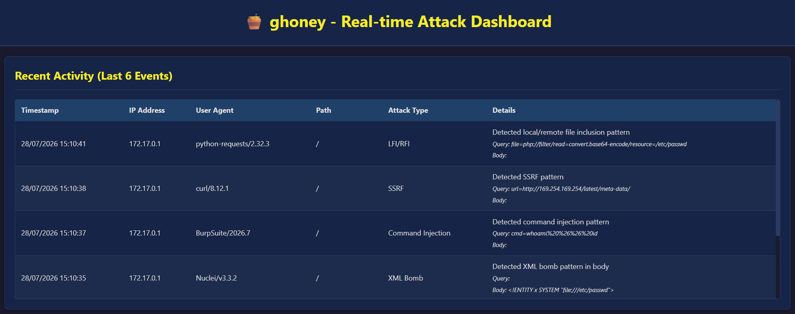

# 🍯 ghoney

```text
       _
  __ _| |__   ___  _ __   ___ _   _
 / _` | '_ \ / _ \| '_ \ / _ \ | | |
| (_| | | | | (_) | | | |  __/ |_| |
 \__, |_| |_|\___/|_| |_|\___|\__, |
 |___/                        |___/
```

**A small HTTP canary for the noisy parts of the internet.**

[](https://go.dev/)
[](https://www.docker.com/)
[](LICENSE)

**ghoney** exposes believable bait endpoints, detects common attack patterns, and turns the resulting traffic into structured logs, [Prometheus](https://prometheus.io/) metrics, and a live dashboard. It stays deliberately small and ephemeral, with a [Distroless](https://github.com/GoogleContainerTools/distroless) image, a non-root runtime, a read-only filesystem, and optional [gVisor](https://gvisor.dev/) + [seccomp](https://en.wikipedia.org/wiki/Seccomp) isolation.



## ✨ What it catches

- SQL injection, path traversal, command injection, SSRF, LFI/RFI, and XML entity payloads
- Requests to decoy routes such as `/admin`, `/api/v1/auth`, and `/.git/config`
- Returning clients through a lightweight tracking cookie

Unknown routes respond with a random 1-3 second delay. Recent events are kept in bounded memory, nothing is persisted by the application.

## 🚀 Quick start

You need Git and a running Docker Engine.

```bash
git clone https://github.com/pathei-kosmos/ghoney.git
cd ghoney
docker build -t ghoney .
docker run -d --name ghoney_server --security-opt no-new-privileges -p 8080:8080 --restart unless-stopped --read-only --tmpfs /tmp --tmpfs /run --log-driver=json-file --log-opt max-size=10m --log-opt max-file=3 ghoney
```

Open [localhost:8080/dashboard](http://localhost:8080/dashboard), then try:

| URL | Purpose |
| --- | --- |
| `/admin` | Decoy administrator login |
| `/api/v1/auth` | Decoy authentication API |
| `/.git/config` | Decoy exposed repository configuration |
| `/dashboard` | Live activity dashboard |
| `/metrics` | Prometheus metrics |
| `/health` | Health check |

## 🧪 Verify detection

These requests generate one event for each supported attack family:

```bash
curl -X POST "http://localhost:8080/api/v1/auth" -H "Content-Type: application/x-www-form-urlencoded" --data "u=' OR 1=1 --"
curl "http://localhost:8080/?p=..%2F..%2Fetc%2Fpasswd"
curl -X POST "http://localhost:8080/" -H "Content-Type: application/xml" --data "<!ENTITY x SYSTEM \"file:///etc/passwd\">"
curl "http://localhost:8080/?cmd=whoami%20%26%26%20id"
curl "http://localhost:8080/?url=http://169.254.169.254/latest/meta-data/"
curl "http://localhost:8080/?file=php://filter/read=convert.base64-encode/resource=/etc/passwd"
```

The authentication endpoint responds with `HTTP 200`. The other requests target the undefined `/` route and respond with `HTTP 404` after the intentional delay. All payloads are detected.

Review the events in the dashboard or from the command line:

```bash
curl http://localhost:8080/api/dashboard-data
docker logs ghoney_server
```

## 🛡️ Layered isolation

**ghoney** combines a small application surface with container-level hardening:

| Layer | Role |
| --- | --- |
| **Distroless image** | Ships the server without a shell, package manager, or unnecessary tooling |
| **Non-root + read-only** | Runs as `nonroot` and prevents writes outside the temporary mounts |
| **No new privileges** | Blocks processes from gaining additional privileges |
| **gVisor** | Optionally places a user-space kernel between ghoney and the host |
| **seccomp** | Applies the included syscall policy to the optional `runsc` deployment |

The first three layers are enabled by the quick-start command. No application data is persisted.

On a supported Linux host, **ghoney** can also run behind gVisor with the included seccomp profile. Install and configure `runsc`, confirm that it appears in `docker info`, then use:

```bash
docker run -d --name ghoney_server \
  --runtime=runsc \
  --security-opt seccomp="$(pwd)/seccomp.json" \
  --security-opt no-new-privileges \
  -p 8080:8080 \
  --restart unless-stopped \
  --read-only \
  --tmpfs /tmp \
  --tmpfs /run \
  --log-driver=json-file \
  --log-opt max-size=10m \
  --log-opt max-file=3 \
  ghoney
```

gVisor is optional and is not generally available through Docker Desktop on Windows or macOS.

> **ghoney** is designed to receive hostile input. Keep it isolated, expose only the intended port, and never add real secrets or credentials to its decoys.

## 🧹 Cleanup

```bash
docker stop ghoney_server
docker rm ghoney_server
docker image rm ghoney
```

Released under the [MIT License](LICENSE).
